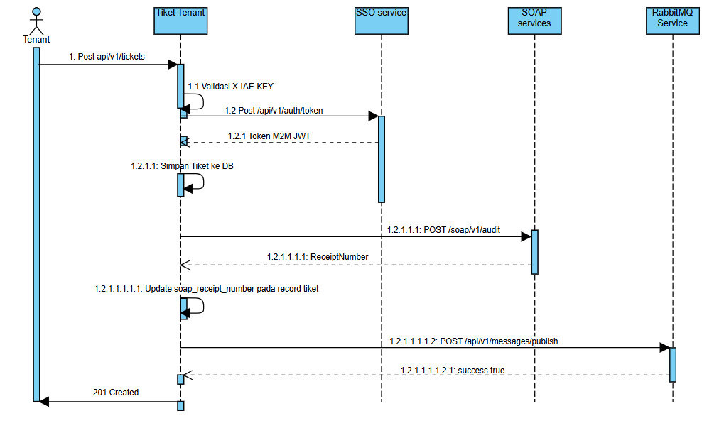

# Analisis Tugas 3: Integrasi Sistem Manajemen Tiket Tenant
**Mata Kuliah:** Integrasi Aplikasi Enterprise (BBK2HAB3)
**Nama Mahasiswa:** Ardhyarino Dawai F

1. Identifikasi Transaksi Kritis

Transaksi POST /api/v1/tickets adalah operasi pengajuan tiket keluhan oleh tenant ketika terjadi kendala atau kerusakan di unit sewanya. Transaksi ini melibatkan tiga service sekaligus, yaitu Service Manajemen Tiket Tenant  sebagai service utama yang menerima dan menyimpan tiket keluhan, Service Listing Unit yang memvalidasi keberadaan unit properti, serta Service Kontrak Sewa yang memvalidasi bahwa kontrak sewa tenant masih aktif.

2. Akuntabilitas & Audit Trail (Legasi SOAP XML)

 Untuk menjamin aspek transparansi operasional dan mencegah adanya manipulasi atau penghapusan log transaksi secara lokal, setiap transaksi kritis wajib dilaporkan ke server audit eksternal milik pusat. Penggunaan protokol SOAP XML menjamin keabsahan data log menggunakan format pesan envelope yang sistematis dan mengembalikan nomor resi unik (ReceiptNumber) untuk disimpan di database sebagai bukti

3. Sinkronisasi Asinkron (RabbitMQ Broadcast)

Pembuatan tiket keluhan baru merupakan sebuah event bisnis yang memicu efek berantai terhadap departemen atau entitas lain (seperti tim teknisi untuk eksekusi perbaikan lapangan dan sistem notifikasi konfirmasi otomatis ke tenant). Dengan mempublikasikan event ticket.created secara asinkron ke RabbitMQ exchange (iae.central.exchange), seluruh consumer yang berkepentingan dapat merespons secara mandiri tanpa memuji keterlambatan respons atau membebani performa kecepatan transaksi utama.


Sequence Diagram Interaksi dengan Layanan Terpusat

Diagram sequence menggambarkan aliran interaksi lengkap dari tenant (klien) hingga seluruh layanan terpusat dosen (SSO M2M, SOAP Audit, RabbitMQ) untuk transaksi POST /api/v1/tickets.


 Penjelasan Alur per Langkah:

* **`POST /api/v1/tickets`** — Tenant mengirim request pembuatan tiket keluhan baru berisi `listing_id`, `contract_id`, dan deskripsi kerusakan, dengan header `X-IAE-KEY` sebagai identitas klien.
* **`1.1 Validasi X-IAE-KEY`** — Service memverifikasi bahwa request berasal dari klien yang sah menggunakan API key lokal. Jika tidak valid, request langsung ditolak dengan status *401 Unauthorized*.
* **`1.2 POST /api/v1/auth/token`** *(hanya jika token M2M belum ada/expired)* — Service meminta token M2M baru ke SSO Dosen menggunakan `CENTRAL_TEAM_API_KEY`. Token ini digunakan untuk autentikasi ke layanan SOAP Audit dan RabbitMQ milik dosen.
* **`1.2.1 200 token M2M_JWT`** — SSO Dosen mengembalikan JWT M2M yang akan dipakai sebagai Bearer Token pada seluruh panggilan ke layanan terpusat dosen.
* **`1.2.1.1 Simpan Tiket ke DB`** — Service menyimpan data tiket baru ke tabel `tickets` di database lokal.
* **`1.2.1.1.1 POST /soap/v1/audit`** — Service mengirim XML Envelope berisi data tiket (`TicketCreated`) ke endpoint audit dosen menggunakan Bearer token M2M. Field `<iae:LogContent>` memuat detail tiket dalam format JSON (dibungkus di dalam `CDATA`).
* **`1.2.1.1.1.1 ReceiptNumber`** — Server audit mengembalikan nomor resi (`ReceiptNumber`) sebagai bukti bahwa transaksi pembuatan tiket sudah tercatat secara resmi di sistem audit legacy.
* **`1.2.1.1.1.1.1 Update soap_receipt_number`** — Service menyimpan `ReceiptNumber` tersebut ke kolom `soap_receipt_number` pada record tiket yang baru dibuat, sebagai referensi audit yang bisa dilacak.
* **`1.2.1.1.1.1.2 POST /messages/publish`** — Service mem-broadcast event `ticket.created` berisi detail tiket ke message broker dosen (`iae.central.exchange`) agar departemen atau service lain (misalnya tim maintenance, notifikasi) dapat merespons secara asinkron.
* **`1.2.1.1.1.1.2.1 success true`** — Message broker mengonfirmasi bahwa event berhasil dipublikasikan tanpa error.
* **`201 Created`** — Service mengembalikan response akhir ke tenant berisi data tiket lengkap beserta `soap_receipt_number` sebagai tanda bahwa transaksi selesai, tersimpan, dan telah teraudit.


Capaian Komponen Teknis & Implementasi

### [cite_start]Modul 1: Federated SSO (Bobot 30%) [cite: 52]
[cite_start]**Indikator:** Aplikasi sukses menangkap payload JWT dari Cloud Dosen dan berhasil memetakan user ke tabel roles lokal[cite: 52].  

* Middleware `VerifySSO.php` berhasil menangkap JWT dari header `Authorization: Bearer`[cite: 52].
* [cite_start]JWT diverifikasi menggunakan public key (JWKS) dari `GET /api/v1/auth/jwks` dengan algoritma RS256[cite: 69].
* Payload JWT (email, nama) dipetakan ke tabel `users` lokal menggunakan `firstOrCreate`, dengan role default `tenant`.
* [cite_start]Untuk transaksi kritis (SOAP & RabbitMQ), aplikasi menggunakan token M2M (`SsoM2MService.php`) dengan `IAE_API_KEY=KEY-MHS-280`, token di-cache 55 menit untuk efisiensi[cite: 69].

**Bukti Log:**
```text
[SSO M2M] Login berhasil {"api_key":"KEY-MHS-280"}
```

---

### [cite_start]Modul 2: SOAP XML Client (Bobot 40%) [cite: 52]
[cite_start]**Indikator:** Kode SOAP Client berhasil melakukan transformasi data JSON ke format XML Envelope kaku dan menyimpan ReceiptNumber dari Dosen[cite: 52].  

* [cite_start]`SoapAuditService.php` mengubah data tiket (JSON) menjadi SOAP XML Envelope sesuai skema wajib (`TeamID`, `ActivityName`, `LogContent` dengan pembungkus `CDATA`)[cite: 76, 88].
* Request dikirim ke endpoint `POST /soap/v1/audit` dengan menggunakan Bearer Token M2M[cite: 69].
* Response berupa XML diparsing menggunakan `simplexml_load_string` dan XPath untuk mengambil data `ReceiptNumber`.
* `ReceiptNumber` disimpan secara lokal ke kolom `soap_receipt` pada tabel database `tickets`[cite: 52].

**Bukti Log:**
```text
[SOAP] Audit berhasil {"receipt":"IAE-LOG-2026-2C9C20CB"}
```

**Response Endpoint (Potongan):**
```json
{
    "soap_receipt": "IAE-LOG-2026-2C9C20CB"
}
```

---

### Modul 3: AMQP Publisher (Bobot 20%) [cite: 52]
**Indikator:** Aplikasi berhasil mengirimkan event notification dalam bentuk JSON ke RabbitMQ Dosen tanpa memicu error[cite: 52].  

* [cite_start]`RabbitMQService.php` mem-publish event `ticket.created` menuju endpoint `POST /api/v1/messages/publish`[cite: 69].
* Payload disesuaikan secara presisi dengan struktur yang diminta server pusat (`routing_key` + `message`).
* Event berhasil tampil di Papan Pengumuman RabbitMQ (`/board`) dengan label **Dari: TEAM-08**.

**Bukti Log:**
```text
[RabbitMQ] Publish berhasil {"event":"ticket.created"}
```

**Full JSON Response:**
```json
{
    "success": true,
    "message": "Tiket berhasil dibuat",
    "data": {
        "id": 2,
        "listing_id": "1",
        "contract_id": "1",
        "tenant_name": "Budi Santoso",
        "tenant_email": "budi@example.com",
        "description": "AC gudang tidak bisa menyala",
        "status": "open",
        "soap_receipt": "IAE-LOG-2026-2C9C20CB",
        "created_at": "2026-06-12T07:48:42.000000Z",
        "updated_at": "2026-06-12T07:48:44.000000Z"
    }
}
```